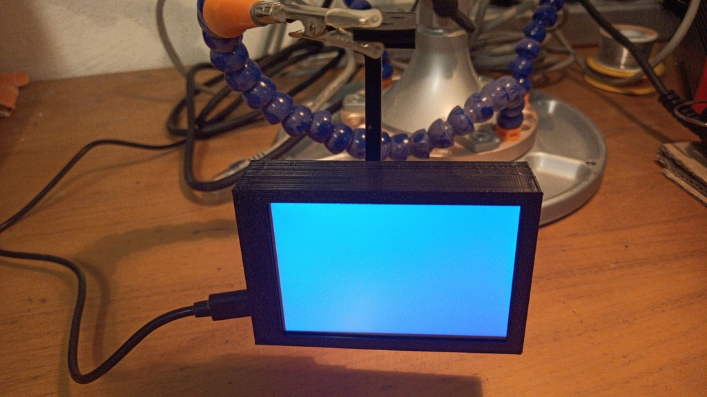
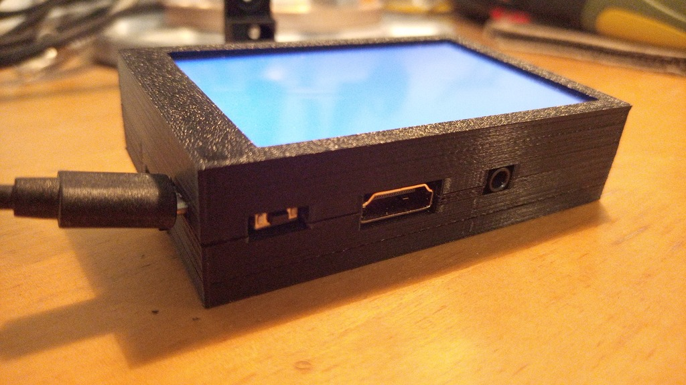
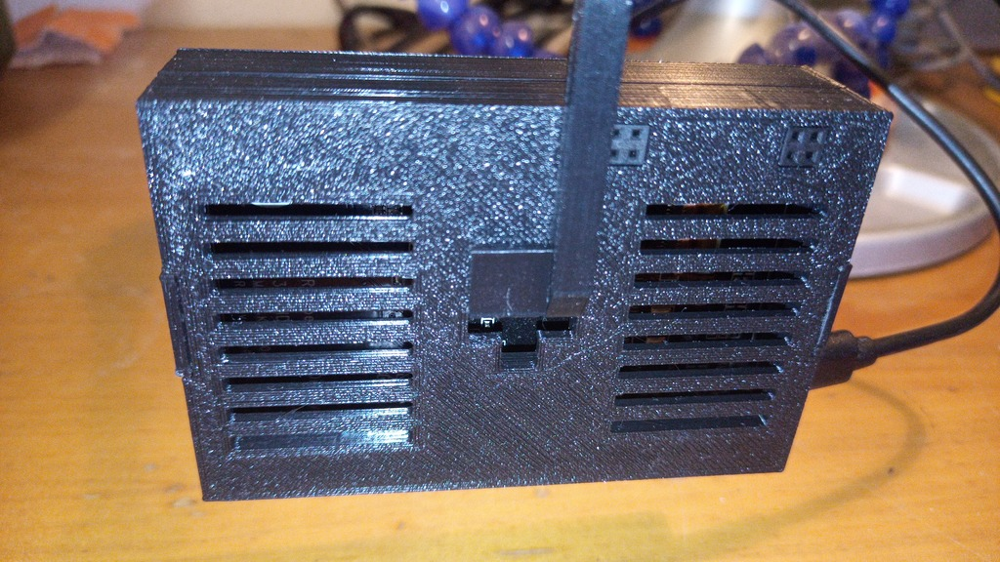
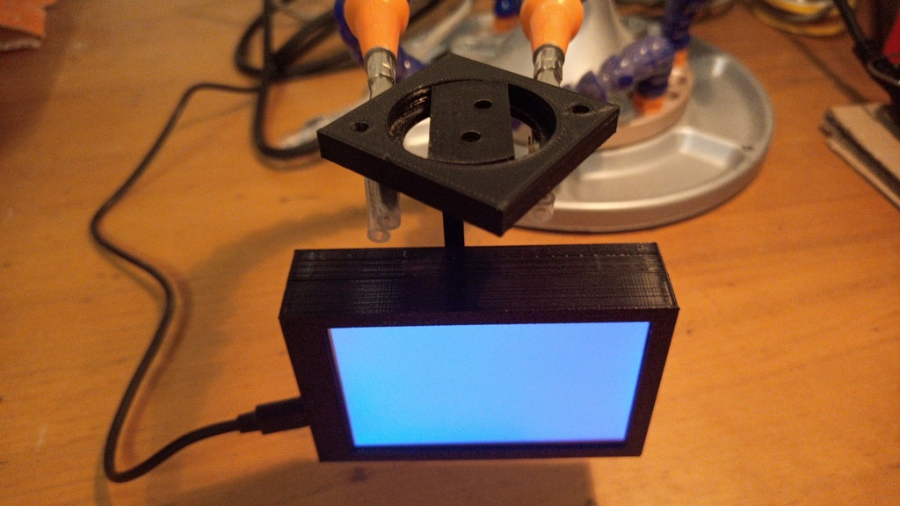
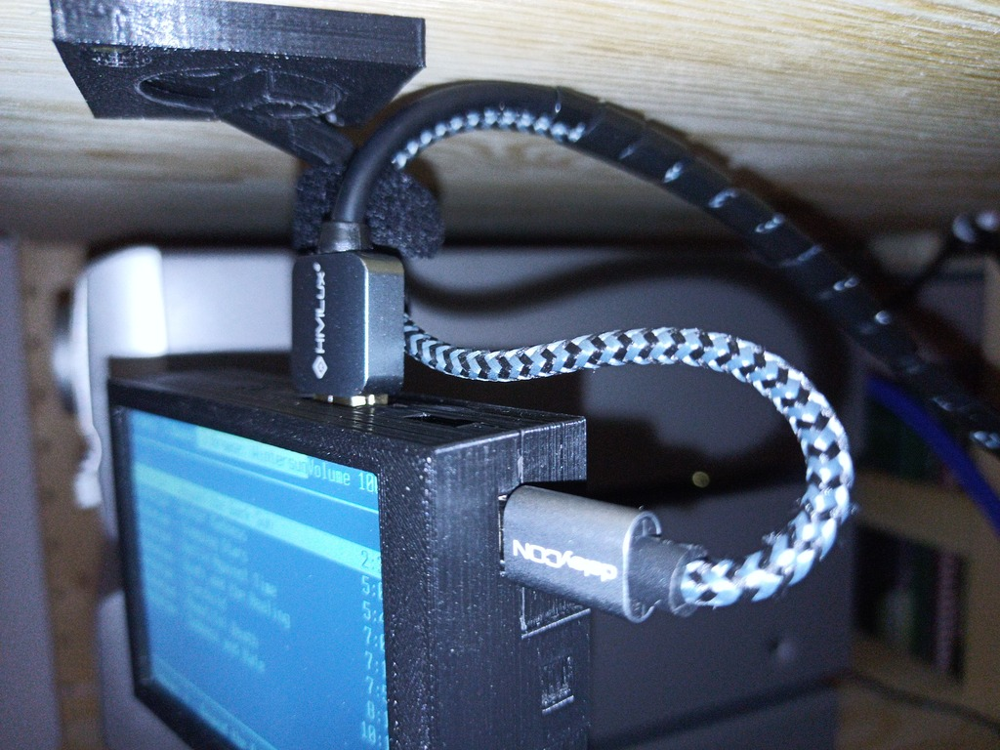
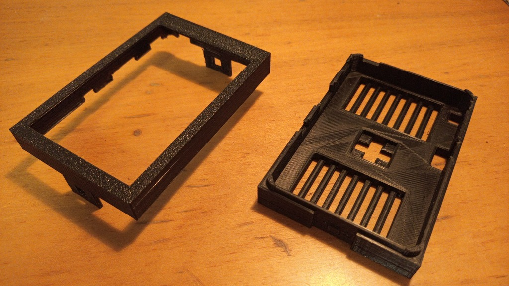
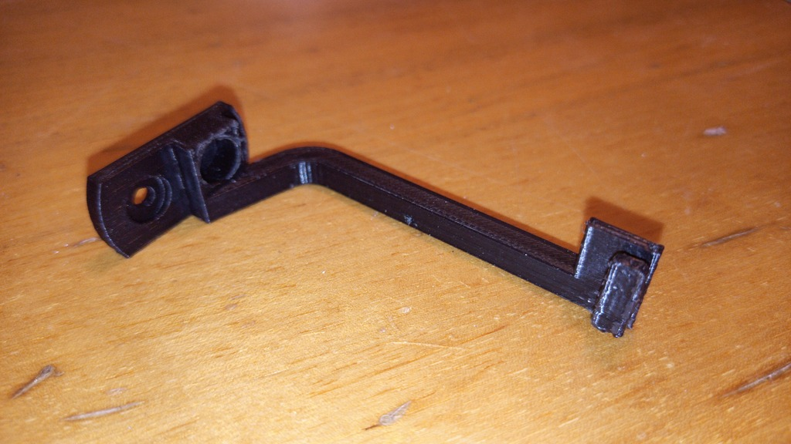

# kedei-display-case

Case for the 3.5 inch HDMI display (for the Raspberry Pi).
This case however is intended to use the display stand-alone (not attached directly to the PI). 
The case can be attached to an arm.
The arm can be mounted fixed or rotatable around z-axis.

When printing, some parts should be rotated so that the biggest flat surface is
on the bed, so that no additional support is needed.
I printed all parts without support, except for the arm (support from bed only).

I also had some issues with bulging corners when assembling the case. I took care of that with a file and some sand paper.

